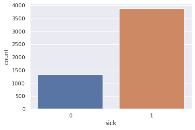
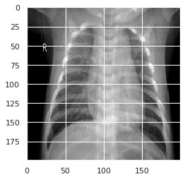

# Chest X-ray analysis for pneumonia detection
 *@author - Alan John*

to see dataset please click [here](https://www.kaggle.com/paultimothymooney/chest-xray-pneumonia)

This is going to be a simple binary classifier made using CNN

## importing libraries


```python
import tensorflow as tf
import pandas as pd
import numpy as np
import cv2 as cv2
import seaborn as sns
import matplotlib.pyplot as plt
```

## prepping the data

### 1.reading data
The data about the pictures is being stored in the CSV files
train is labelled data that will be used for training the model
test will be used for testing the model


```python
train = pd.read_csv("train.csv")
train = train[train.id != 'normal.csv']
train = train[train.id != 'sick.csv']
```


```python
test = pd.read_csv("test.csv")
test = test[test.id != 'normal_test.csv']
test = test[test.id != 'sick_test.csv']
```


```python
train
```


<div>
<table border="1" class="dataframe">
  <thead>
      <th></th>
      <th>id</th>
      <th>sick</th>
    </tr>
  </thead>
  <tbody>
    <tr>
      <th>0</th>
      <td>person277_bacteria_1300.jpeg</td>
      <td>1</td>
    </tr>
    <tr>
      <th>1</th>
      <td>person870_virus_1516.jpeg</td>
      <td>1</td>
    </tr>
    <tr>
      <th>2</th>
      <td>person257_bacteria_1194.jpeg</td>
      <td>1</td>
    </tr>
    <tr>
      <th>3</th>
      <td>NORMAL2-IM-0822-0001.jpeg</td>
      <td>0</td>
    </tr>
    <tr>
      <th>4</th>
      <td>person1545_bacteria_4042.jpeg</td>
      <td>1</td>
    </tr>
    <tr>
      <th>5</th>
      <td>person1171_bacteria_3118.jpeg</td>
      <td>1</td>
    </tr>
    <tr>
      <th>6</th>
      <td>person1414_virus_2424.jpeg</td>
      <td>1</td>
    </tr>
    <tr>
      <th>7</th>
      <td>person783_bacteria_2687.jpeg</td>
      <td>1</td>
    </tr>
    <tr>
      <th>8</th>
      <td>person30_bacteria_148.jpeg</td>
      <td>1</td>
    </tr>
    <tr>
      <th>9</th>
      <td>NORMAL2-IM-1028-0001.jpeg</td>
      <td>0</td>
    </tr>
    <tr>
      <th>10</th>
      <td>person1090_virus_1809.jpeg</td>
      <td>1</td>
    </tr>
    <tr>
      <th>11</th>
      <td>person1343_virus_2317.jpeg</td>
      <td>1</td>
    </tr>
    <tr>
      <th>12</th>
      <td>person491_bacteria_2073.jpeg</td>
      <td>1</td>
    </tr>
    <tr>
      <th>13</th>
      <td>person1030_virus_1722.jpeg</td>
      <td>1</td>
    </tr>
    <tr>
      <th>14</th>
      <td>person1312_bacteria_3317.jpeg</td>
      <td>1</td>
    </tr>
    <tr>
      <th>15</th>
      <td>NORMAL2-IM-1279-0001.jpeg</td>
      <td>0</td>
    </tr>
    <tr>
      <th>16</th>
      <td>person534_bacteria_2251.jpeg</td>
      <td>1</td>
    </tr>
    <tr>
      <th>17</th>
      <td>person1045_virus_1741.jpeg</td>
      <td>1</td>
    </tr>
    <tr>
      <th>18</th>
      <td>IM-0522-0001.jpeg</td>
      <td>0</td>
    </tr>
    <tr>
      <th>19</th>
      <td>person71_bacteria_348.jpeg</td>
      <td>1</td>
    </tr>
    <tr>
      <th>20</th>
      <td>person331_virus_684.jpeg</td>
      <td>1</td>
    </tr>
    <tr>
      <th>21</th>
      <td>person1514_bacteria_3964.jpeg</td>
      <td>1</td>
    </tr>
    <tr>
      <th>22</th>
      <td>person967_virus_1640.jpeg</td>
      <td>1</td>
    </tr>
    <tr>
      <th>23</th>
      <td>person118_virus_224.jpeg</td>
      <td>1</td>
    </tr>
    <tr>
      <th>24</th>
      <td>person725_bacteria_2627.jpeg</td>
      <td>1</td>
    </tr>
    <tr>
      <th>25</th>
      <td>NORMAL2-IM-0971-0001-0001.jpeg</td>
      <td>0</td>
    </tr>
    <tr>
      <th>26</th>
      <td>person1671_bacteria_4432.jpeg</td>
      <td>1</td>
    </tr>
    <tr>
      <th>27</th>
      <td>person1599_bacteria_4200.jpeg</td>
      <td>1</td>
    </tr>
    <tr>
      <th>28</th>
      <td>person26_bacteria_133.jpeg</td>
      <td>1</td>
    </tr>
    <tr>
      <th>29</th>
      <td>person1367_virus_2351.jpeg</td>
      <td>1</td>
    </tr>
    <tr>
      <th>...</th>
      <td>...</td>
      <td>...</td>
    </tr>
    <tr>
      <th>5188</th>
      <td>person1186_virus_2022.jpeg</td>
      <td>1</td>
    </tr>
    <tr>
      <th>5189</th>
      <td>person699_virus_1295.jpeg</td>
      <td>1</td>
    </tr>
    <tr>
      <th>5190</th>
      <td>NORMAL2-IM-0429-0001.jpeg</td>
      <td>0</td>
    </tr>
    <tr>
      <th>5191</th>
      <td>person484_virus_986.jpeg</td>
      <td>1</td>
    </tr>
    <tr>
      <th>5192</th>
      <td>IM-0652-0001-0002.jpeg</td>
      <td>0</td>
    </tr>
    <tr>
      <th>5193</th>
      <td>person13_bacteria_50.jpeg</td>
      <td>1</td>
    </tr>
    <tr>
      <th>5194</th>
      <td>NORMAL2-IM-0951-0001.jpeg</td>
      <td>0</td>
    </tr>
    <tr>
      <th>5195</th>
      <td>NORMAL2-IM-0620-0001.jpeg</td>
      <td>0</td>
    </tr>
    <tr>
      <th>5196</th>
      <td>NORMAL2-IM-0478-0001.jpeg</td>
      <td>0</td>
    </tr>
    <tr>
      <th>5197</th>
      <td>NORMAL2-IM-0894-0001.jpeg</td>
      <td>0</td>
    </tr>
    <tr>
      <th>5198</th>
      <td>person661_virus_1245.jpeg</td>
      <td>1</td>
    </tr>
    <tr>
      <th>5199</th>
      <td>person375_virus_758.jpeg</td>
      <td>1</td>
    </tr>
    <tr>
      <th>5200</th>
      <td>person425_bacteria_1860.jpeg</td>
      <td>1</td>
    </tr>
    <tr>
      <th>5201</th>
      <td>person780_bacteria_2684.jpeg</td>
      <td>1</td>
    </tr>
    <tr>
      <th>5202</th>
      <td>NORMAL2-IM-0392-0001.jpeg</td>
      <td>0</td>
    </tr>
    <tr>
      <th>5203</th>
      <td>person605_bacteria_2465.jpeg</td>
      <td>1</td>
    </tr>
    <tr>
      <th>5204</th>
      <td>person364_bacteria_1660.jpeg</td>
      <td>1</td>
    </tr>
    <tr>
      <th>5205</th>
      <td>person588_virus_1135.jpeg</td>
      <td>1</td>
    </tr>
    <tr>
      <th>5206</th>
      <td>person74_bacteria_363.jpeg</td>
      <td>1</td>
    </tr>
    <tr>
      <th>5207</th>
      <td>person1233_bacteria_3188.jpeg</td>
      <td>1</td>
    </tr>
    <tr>
      <th>5208</th>
      <td>person1167_bacteria_3113.jpeg</td>
      <td>1</td>
    </tr>
    <tr>
      <th>5209</th>
      <td>person23_bacteria_93.jpeg</td>
      <td>1</td>
    </tr>
    <tr>
      <th>5210</th>
      <td>person1129_virus_1857.jpeg</td>
      <td>1</td>
    </tr>
    <tr>
      <th>5211</th>
      <td>person520_bacteria_2204.jpeg</td>
      <td>1</td>
    </tr>
    <tr>
      <th>5212</th>
      <td>IM-0560-0001.jpeg</td>
      <td>0</td>
    </tr>
    <tr>
      <th>5213</th>
      <td>person319_bacteria_1479.jpeg</td>
      <td>1</td>
    </tr>
    <tr>
      <th>5214</th>
      <td>person1125_bacteria_3066.jpeg</td>
      <td>1</td>
    </tr>
    <tr>
      <th>5215</th>
      <td>IM-0575-0001.jpeg</td>
      <td>0</td>
    </tr>
    <tr>
      <th>5216</th>
      <td>person1458_virus_2503.jpeg</td>
      <td>1</td>
    </tr>
    <tr>
      <th>5217</th>
      <td>NORMAL2-IM-0583-0001.jpeg</td>
      <td>0</td>
    </tr>
  </tbody>
</table>
<p>5216 rows × 2 columns</p>
</div>


below we can see that the dataset is slightly lopsided towards sick examples


```python
import seaborn as sns
sns.set(style="darkgrid")

ax = sns.countplot(x="sick", data=train)
```





### 2.reading the images
***
so our training data has the labels of the **5216** x-ray images and the testing data has the labels of **624** images <br>
as this is comparitively large dataset of images of high resolution and different sizes , we'll need to resize them to a smaller size <br>
here we are resizing all images to 200 * 200 
tf.keras.util.normalize normalizes the data to make it usable by our training data


```python
images_train = [tf.keras.utils.normalize(cv2.resize(cv2.imread("train/"+x , 0), (200,200))) for x in train["id"]]
images_train =  np.array(images_train).reshape(5216,200,200,1)

images_test = [tf.keras.utils.normalize(cv2.resize(cv2.imread("test/"+x , 0), (200,200))) for x in test["id"]]

images_test =  np.array(images_test).reshape(624, 200,200 ,1)

res_train = list(train["sick"])

res_test = list(test["sick"])
```

## The CNN

we'll be using tensorboard to monitor the training of the model


```python
%reload_ext tensorboard
%tensorboard --logdir key
```

### The model

* our first layer is 2D convolution layer that has 128 nodes and 2D convolution occurs on a kernel size of 2X2.it also defines the input layer which has a shape of 200 X 200 X 1
* second layer we have is a maxpooling layer that takes the maximum out of a 2X2 area
* next we have a dropout layer to randomize weights to prevent overfitting
* all this is followed by a couple more layers of 2D convolution and maxpooling and another dropout
* next we flatten the entire the 3D shape into a 1D shape
* next we have a normal dense layer of 64 nodes followed by a dropout and another dense layer 
* at the end we have a dense layer with 1 node to act as the output
* the activation used mostly is relu i.e f(x) = max(max,0)
* In the end a sigmoid activation is used as that is most apt for a binary classifier with one node in output layer


```python
from tensorflow.keras.layers import Dense,Conv2D,Flatten,MaxPooling2D,Dropout
model = tf.keras.Sequential()

# block 1
from tensorflow.keras.layers import Dense,Conv2D,Flatten,MaxPooling2D,Dropout

model = tf.keras.models.Sequential()
model.add(Conv2D(128, kernel_size = (2,2) , activation = 'relu' , input_shape = (200,200,1)))
model.add(MaxPooling2D(pool_size=(2,2)))
model.add(Dropout(0.4))
model.add(Conv2D(64, kernel_size = (2,2) , activation = 'relu' ))
model.add(MaxPooling2D(pool_size=(2,2)))
model.add(Conv2D(32, kernel_size = (2,2) , activation = 'relu' ))
model.add(MaxPooling2D(pool_size=(2,2)))
model.add(Dropout(0.4))
model.add(Flatten())
model.add(Dense(64, activation ='relu'))
model.add(Dropout(0.4))
model.add(Dense(32, activation ='relu'))
model.add(Dense(1,activation = "sigmoid"))
```


The below command is to read previously trained models


```python
from tensorflow.keras.models import model_from_json
json = open('chestxray.json','r')
model = json.read()
model = model_from_json(model)
model.load_weights('chestxray.h5')
```

here we compile the model and set the optimizer used to adjust the weights as well as the loss function <br>
we can also set up more metrics to observer the learning process


```python
model.compile(optimizer = "adam" , loss = "binary_crossentropy" , metrics = ["accuracy"])
```

model.fit is the command that trains the model 
* first paramater is the input and second is the expected output
* epochs is the number of times the model should go over the entire dataset 
* batch_size is the number of training data examples after which the optimizer should check loss and optimize the model weights
* we have added a callback to the tensorboard here


```python
model.fit(images_train,res_train,epochs = 1,batch_size=128,callbacks=[tf.keras.callbacks.TensorBoard('key',histogram_freq=1)])
```

## testing 


```python
score = model.evaluate(images_test, res_test, batch_size=32)
print(score)
```

    624/624 [==============================] - 10s 15ms/sample - loss: 0.1975 - acc: 0.9279
    [0.1975427365455872, 0.92788464]


```python
check = model.predict_classes(images_test)
```
Function to predict class in test sample

```python
def show_test(i):
    plt.imshow(images_test[i].reshape(200,200),cmap='gray')
    plt.show()
def predict_test(i):
    show_test(i)
    print(check[i])
    print(res_test[i])

```


```python
predict_test(24)
```





    [1]
    1


### f1 score
in case of classification problems , the F1 score is widely considered as the most apt way to judge how good the sequential model is


```python
tpcount = 0
fpcount = 0
fncount = 0
for i in range(0,624):
    if check[i] == 1 and res_test[i] == 1:
        tpcount = tpcount + 1
    if check[i] == 0 and res_test[i] == 1:
        fncount = fncount + 1
    if check[i] == 1 and res_test[i] == 0:
        fpcount = fpcount + 1

precision = tpcount / (tpcount+fpcount)
recall = tpcount / (tpcount+fncount)
recall

f1 = 2 * (precision*recall)/(precision+recall)
```


```python
f1
```


    0.942084942084942


### saving the model 
the model has been saved to avoid training data again and again as well as to use this model in applications for prediction


```python
model_json = model.to_json()
with open("chestxray.json", "w") as json_file:
    json_file.write(model_json)
model.save_weights("chestxray.h5")
```
